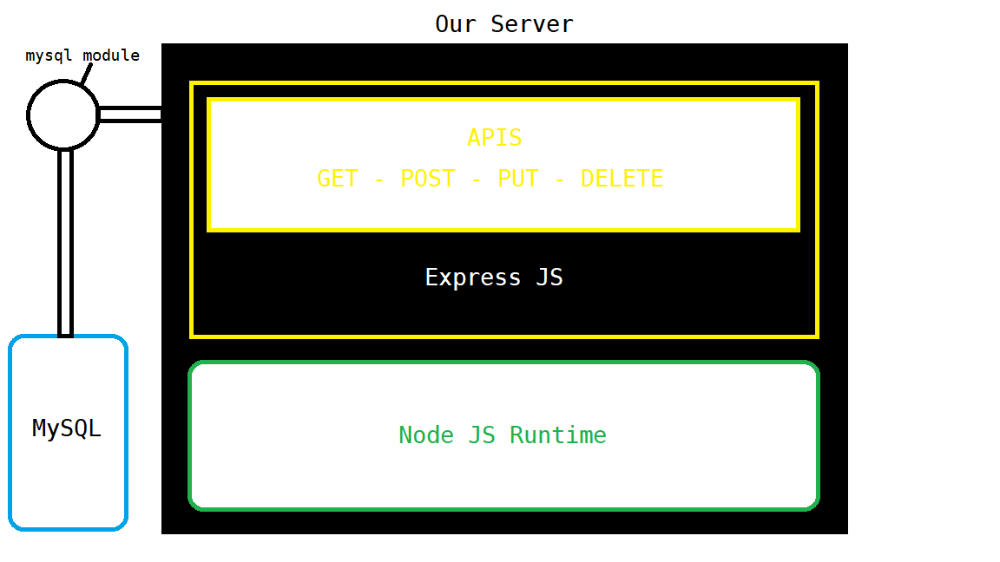

# Full Stack Crud System

From Development to deployment

## Step 1

Run `npm init -y`

## Step 2

Run `npm i nodemon`
Ceate an index.js file.
Then configure the entry point in package.json using
start scripts.

Set up your port configuration.

## Step 3

Run `npm install express body-parser mysql2 cors`

## Step 4

Set up the database configuration. We are using the mysql module.

```javascript
const db = mysql.createConnection({
  host: "localhost",
  user: "root",
  password: "admin",
  database: "pencom-apps",
});
```

Here, we define db as a constant to represent the function mysql.createConnection, which authenticates
with our database effectively.

## Step 5

Now we'd go ahead to work on creating the apis in Express.

Before proceeding, you would notice another import for cors.:

```javascript
const cors = require("cors");
```

Here we import the cors module, to ensure cross-origin resource sharing of various resources across our sever and client, to avoid being denied for "no authorization"

## Step 6

In your index.js, you should create a function to send a response to the client which you would be able
to view. So you call app which you represent express with, use the '.' accessor and append the "get"
method - passing in (request, and response) as parameters and returning the response to the client in
json.

```javascript
app.get("/", (req, res) => {
  res.json("Nodejs Landing Page");
});
```

## Step 7

I strongly recommend you use Postman to work with these endpoints.
The endpoints included in this project include:

1. GET - http://localhost:5000/staff, by sending a GET request to the route "/staff" the api returns all records in the database.
2. POST - http://localhost:5000/staff, by sending a POST request to the route "/staff" the api stores a new record
3. PUT - http://localhost:5000/staff/:id, by sending a PUT request to the route "/staff" the api updates a new record
4. DELETE - http://localhost:5000/staff/:id, by sending a DELETE request to the route "/staff" the api deletes a new record.

Let us dissect this piece of code as a sample for the other requests made:

```javascript
app.post("/staff", (req, res) => {
  const q =
    "INSERT INTO staff(`firstname`, `lastname`, `gender`, `position`, `dofa`) VALUES (?)";

  const values = [
    req.body.firstname,
    req.body.lastname,
    req.body.gender,
    req.body.position,
    req.body.dofa,
  ];

  db.query(q, [values], (err, data) => {
    if (err) return res.send(err);
    return res.json(data);
  });
});
```

Take the above for example, we call:

```javascript
app.post();
```

post is a method in express that we use to pass in parameters dedicated for a post request.

```javascript
const q
```

We then define const q (which represents query in this case) then we write the SQL Query to be executed
in a string.

```javascript
const values = [
  req.body.firstname,
  req.body.lastname,
  req.body.gender,
  req.body.position,
  req.body.dofa,
];
```

Here we call `req` representing request and we append `body`
The ``req.body` is an object containing text parameters from the parsed request body, defaulting to {}
By default this is parsed in JSON format. But middleware configurations could be used to integrate XML.

Now we create a function that executes the query, as we pass in the defined constants as parameters.

```javascript
db.query(q, [values], (err, data) => {
  if (err) return res.send(err);
  return res.json(data);
});
```

It is worthy to note `query` is a predefined keyword in the mysql module, that executes the query once it is authenticated to the database.

We then perform a simple error handling encapusulated in the query function.

Remember that `[value]` is passed in within square brackets due to us definfing `value` as an array of objects in the above constant.

## Step 8

Where we are and the structure of the backend so far, so you could visualise.



## Step 9

Let us proceed with creating the client.
Here we used Yarn.
Avoid mixing dependencies. Only use Yarn, when a `yarn.lock` is present and npm when a `package-lock.json` is present.
NPX stands for node package execute and bundles with `package-lock.json` therefore we would use the yarn command.

## Step 10

Run

```shell
yarn create react-app front-end
```

To generate the React CRA scaffolding for our view section.

## Step 11

It is important we install react-router-dom, in order to route our user to the desired page on the click
of a button, otherwise link - or on entry or update of a new record in our databse.
Run

````shell
yarn add react-router-dom@6```
````

Note, we used version six for this example - just incase you receive errors for wrong imports done.

## Step 12

Install Axios. Axios is a JavaScript library used to make HTTP requests from Nodejs. It sends asynchronous requests to our Nodejs/Express REST (Representative State Transfer) API endpoints and returns a promise.

````shell
yarn add axios```
````

## Step 13

Clean out your working folder of unused test scripts and svg files. In your src folder, create a folder
called "pages."

## Step 14

Open up you App.js

```javascript
import { BrowserRouter, Routes, Route } from "react-router-dom";
import Staff from "./pages/Staff";
import AddStaff from "./pages/AddStaff";
import UpdateStaff from "./pages/UpdateStaff";

function App() {
  return (
    <BrowserRouter>
      <div className='App'>
        <Routes>
          <Route exact path='/' element={<Staff />} />
          <Route path='/AddStaff' element={<AddStaff />} />
          <Route path='/UpdateStaff/:id' element={<UpdateStaff />} />
        </Routes>
      </div>
    </BrowserRouter>
  );
}

export default App;
```

Here we imported the necessary modules from react-router-dom and the pages from `pages.`
Then in the main function, which is app, we appended the <BrowserRouter> Element. This is because
every other component of react-router-dom is to be encapsulated to prevent a blank page.
There are two ways of accomplishing this, the one above and this below:

```javascript
import React from "react";
import ReactDOM from "react-dom/client";
import "./index.css";
import App from "./App";
import { BrowserRouter } from "react-router-doom";

const root = ReactDOM.createRoot(document.getElementById("root"));
root.render(
  <BrowserRouter>
    <App />
  </BrowserRouter>
);
```

Both would suffice in any case.

## Step 15

Three pages should be created.

1. AddStaff - To add our records to the database.
2. Staff - Our home page displaying all records.
3. UpdateStaff - To update records.

PLEASE, a delete page is not necessary.

## Step 16

For the staff page, we created a table scaffolding in JSX. An empty one.
We plan to map all records by id to one block of componets which is expected to increment accordingly.

```javascript
import React, { useState } from "react";
```

Now we apply useState below.

```javascript
const Staff = () => {
  const [staff, setStaff] = useState([]);
};
```

Here as usual, we set the initial state, and the the state we expect to be updated.
Here we declared an empty state array, because basically our records are returned in arrays.

```javascript
useState([]);
```

## Step 17

The useState hook. From the second week of the class, we learnt useEffect is used to add side effects
to components and is an excellent hook when dealing with APIs, which we tested. Here we use the hook.

```javascript
useEffect(() =>)
```

```javascript
useEffect(() => {
  const fetchAllStaff = async () => {
    try {
      const response = await axios.get("http://localhost:5000/staff");
      setStaff(response.data);
    } catch (error) {
      console.log(error);
    }
  };
  fetchAllStaff();
}, []);
```

We want to fetch all staff. We declare the function represented by fetchAllStaff with the
`async` and `await` to expect a promise returned by the asynchronous method.
By doing this, it makes the code wait at that point until the promise is settled, at which point the fulfilled value of the promise is treated as a return value, or the rejected value is thrown.
Here we define the constant response.

We await, call axios and the `get` method by the URL of our backend's rest api endpoint.
If you attempt to click on the link, you would see the entire api spilled on the browser in JSON format.

## Step 18

Here we map the elements by their id and increment.

```javascript
{staff.map((item, index) => (
    <tr key={item.id}>
    <th scope='row'>{index + 1}</th>
    <td>{item.firstname}</td>
    <td>{item.lastname}</td>
    <td>{item.gender}</td>
    <td>{item.position}</td>
    <td>{item.dofa}</td>
))}
```

## Step 19

Updating our records.

```javascript
<Link to={`/UpdateStaff/${item.id}`}>
  <button className='btn btn-edit'>Update</button>
</Link>
```

We react-router-dom's `<Link>` to take users to the Update page, to be done on a specific id, defined
by the `$` accessor nd encapsulated in back-ticks, otherwise template literals. We will get back to this.

## Step 20

Deleting records

```javascript
<button className='btn btn-delete' onClick={() => DeleteStaff(item.id)}>
  Delete
</button>
```

Here we pass in DeleteStaff by the parameter, `(item.id)`.

OnClick this would trigger the below function:

```javascript
const DeleteStaff = async (id) => {
  try {
    await axios.delete(`http://localhost:5000/staff/${id}`);
    window.location.reload();
  } catch (err) {
    console.log(err);
  }
};
```

We call `delete` in axios, to remove the records.

## Step 20

```javascript
const AddStaff = () => {
  const [staff, setStaff] = useState({
    firstname: "",
    lastname: "",
    gender: "",
    position: "",
    date: "",
  });
  const [error, setError] = useState(false);

  const navigate = useNavigate();

  const handleChange = (e) => {
    setStaff((prev) => ({ ...prev, [e.target.name]: e.target.value }));
  };

  const handleSubmit = async (e) => {
    e.preventDefault();
    try {
      await axios.post("http://localhost:5000/staff", staff);
      navigate("/");
    } catch (error) {
      console.log(error);
      setError(true);
    }
  };
};
```

The following function above posts the records to the database, on Submit

`useNavigate` a keyword in React-Router-Dom routes us to the staff page on the adition of a new record.

## Step 21

For the update, we basicaly copied and pasted the same scaffolding for add.
The significant change in our try and catch block is below:

```javascript
await axios.put(`http://localhost:5000/staff/${staffId}`, staff);
```

We employ the `put` method to the specific id fused into the URL.

## Step 22

Building our sever and client for deployment and dockerization of our application.


## Step 23

Create a production and development branch

## Step 24

In your terminal, run

```git
git branch
```

If you see just one branch run

```git
git branch -a
```

Shows all branches. Now to switch to the production branch we intend
to deploy:

run

```git
git checkout master
```

To know the branch you are on.
Now run

```git
git checkout -b <branch>
```

The -b flag stands for branch

Once that is done, you can proceed to dockerizing the application.

## Step 26

Create a .dockerfile-front-end. You can do this on Linux/Unix or through the
terminal using the touch command.
That is:

```shell
touch .dockerfile.front-end
```

Or just create manually.

## Step 27

Open up the docker file and add the following FOR OUR FRONTEND:

```docker
FROM node:16
```

So our image would use a minimum of node js, version 16.

Define our Working Directory

```docker
WORKDIR /back-end
```

Copy the package.json in the backend, and front-end
This command goes to the local host machine and copies the package.json files that include the dependencies to our image.

```docker
COPY ./package.json ./package.json
COPY ./public ./public
```

Then copy the source folder.

```docker
COPY ./src ./src
```

Run Yarn Install to install the dependencies

```docker
RUN yarn install
```

Expose the Docker PORT

Then you have to Run Yarn Start using Docker's CMD command:

```docker
CMD ["yarn", "start"]
```

## Step 28

Dockerize the Nodejs app, by creating a dockerfile for it as above.

Then what you should have is:

```docker
FROM node:16
WORKDIR /back-end
COPY ./package.json ./package.json
COPY ./index. js ./index.js
RUN npm install
EXPOSE 9000
CMD ["node", "index.js"]
```

## Step 29

You can use the Docker extension GUI.
Type Control + Shift + P

Just follow the instructions for nodejs

## Step 30

Before building the image, configure your nodejs for production.
Create an .env file.

Once you have created that, set up a .gitignore file and add these:

```gitignore
env
.enc
node_modules
```

Then uninstall nodemon

## Step 31

Install dotenv using:

```npm
npm install dotenv
```

Then append the import to index.js

```javascript
require("dotenv");
```

Set up a docker-compose using this sample configuration below

```yml
version: "3.4"

services:
  backend:
    depends_on:
      - mysqldb
    image: backend
    build:
      context: back-end
      dockerfile: ./Dockerfile
    environment:
      - DB_HOST=mysqldb
      - DB_USER=$MYSQLDB_USER
      - DB_PASSWORD=$MYSQLDB_ROOT_PASSWORD
      - DB_NAME=$MYSQLDB_DATABASE
      - DB_PORT=$MYSQLDB_DOCKER_PORT
    stdin_open: true
    tty: true
    ports:
      - 9000:9000
  frontend:
    image: frontend
    build:
      context: front-end
      dockerfile: ./Dockerfile
    environment:
      NODE_ENV: production
    ports:
      - 9000:9000d
  mysqldb:
    image: mysql:8.0
    restart: unless-stopped
    env_file: ./.env
    environment:
      - MYSQL_ROOT_PASSWORD=$MYSQLDB_ROOT_PASSWORD
      - MYSQL_DATABASE=$MYSQLDB_DATABASE
    ports:
      - $MYSQLDB_LOCAL_PORT:$MYSQLDB_DOCKER_PORT
    volumes:
      - db:/var/lib/mysql
volumes:
  db:
```

To build your dockerfile.
Run:

```shell
ocker-compose -f docker/docker-compose.yml up -d
```

This triggers the docker-engine to spin up containers for the image.
